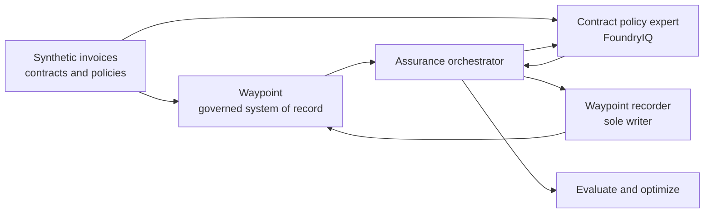

<p align="center">
  <picture>
    <source
      media="(prefers-color-scheme: dark)"
      srcset="https://raw.githubusercontent.com/caldova/.github/main/profile/assets/caldova-logo-white.svg"
    />
    <source
      media="(prefers-color-scheme: light)"
      srcset="https://raw.githubusercontent.com/caldova/.github/main/profile/assets/caldova-logo-color.svg"
    />
    
  </picture>
</p>

<h1 align="center">Waypoint</h1>

<p align="center">
  <strong>
    One repo. One Azure deployment. One live, contract-grounded story.
  </strong>
  <br />
  From synthetic business records to hosted Foundry agents and governed
  application workflows.
</p>

<p align="center">
  <a href="https://github.com/caldova/waypoint/actions/workflows/deploy.yml">
    
  </a>
  <a href="https://github.com/copilot/app/launch?open=ghapp%3A%2F%2Fsession%2Fnew%3Frepo%3Dcaldova%252Fwaypoint%26mode%3Dinteractive%26prompt%3DStart%2520the%2520Pharmashield%2520Foundry%2520demo.">
    
  </a>
</p>

<p align="center">
  <a href="docs/getting-started.md">Developer setup</a>
  ·
  <a href="docs/architecture.md">Architecture</a>
  ·
  <a href="docs/status.md">Project status</a>
</p>

Waypoint is Caldova's invoice assurance workspace for contract manufacturing.
Caldova is a fictional pharmaceutical operations company used to demonstrate
how a real enterprise application can combine business records, governed agent
workflows, evaluation, optimization, and deployment automation.

> [!NOTE]
> All suppliers, invoices, contracts, policies, findings, and evidence in this
> repository are synthetic demo data.

## Deploy once, present the story

The complete demo path has two parts: deploy the shared Azure environment,
then open the live presenter experience. If your team already has a working
Waypoint environment with `contract-policy-expert`, skip directly to
[Present the demo](#2-present-the-demo).

### 1. Deploy the demo environment

#### Configure deployment access once

> [!IMPORTANT]
> A deployment owner must establish GitHub-to-Azure OIDC trust once for this
> repository in each target tenant. The repeatable deployment is one click after this
> trust is configured. No Azure client secret is stored in GitHub.

The deployment owner needs:

- an Azure identity that can create app registrations, service principals,
  resource groups, and role assignments;
- repository administrator access;
- Azure CLI, GitHub CLI, and `jq`; and
- an authenticated Azure and GitHub CLI session.

```bash
az login
gh auth login

tools/deploy/scripts/oidc.sh \
  --owner caldova \
  --repo waypoint \
  --subscription-id "$(az account show --query id -o tsv)" \
  --app-name waypoint-gha-oidc \
  --branch main \
  --pull-request
```

The bootstrap is idempotent. It creates or reuses the deployment identity,
configures GitHub's federated credential, assigns the required Azure roles, and
writes the repository variables consumed by the deployment workflow.

See [Azure deployment](docs/deployment.md) for permissions, optional settings,
parallel environments, and troubleshooting.

#### Run the deployment

[](https://github.com/caldova/waypoint/actions/workflows/deploy.yml)

1. Select **Run workflow**.
2. Keep the defaults for a first deployment.
3. Start the workflow and follow the acceptance job through completion.

The default path deploys:

- the Waypoint web application, API, PostgreSQL database, authentication, and
  telemetry;
- the synthetic corpus and Waypoint seed data;
- the Foundry project, model deployments, search, and `contracts-kb`;
- `invoice-analyst`, `assurance-orchestrator`, `contract-policy-expert`, and
  `waypoint-recorder`; and
- an acceptance artifact proving endpoint health, hosted-agent inventory, and
  a completed orchestrator-to-recorder run.

The launch package is FoundryIQ-only. Fabric/OneLake, WorkIQ, WebIQ, and
FabricIQ modules remain in the repository for future development but are not
inputs, stages, resources, or agents in the one-click deployment.

The full default deployment has been validated end to end in **East US 2**,
including an unchanged rerun that reused stable resources and skipped unchanged
hosted-agent versions. Region selection matters: the deployment must co-locate
Azure AI Search, Foundry, and the model for real contract-grounded knowledge-base
retrieval, and it depends on live Foundry hosted-agent provisioning in the chosen
region. Both are subject to Azure capacity and regional platform health at deploy
time — see
[platform and environmental blockers](docs/deployment-troubleshooting.md#platform-and-environmental-blockers-encountered)
before choosing a region. In the app, a reviewer can run assurance for one
invoice or select up to 25 visible invoices and start a batch. The batch starts
at most four new orchestrations concurrently, reuses active invoice runs, and
reports independent accepted, reused, not-found, or start-failed outcomes. Every
run invokes `assurance-orchestrator` and persists its result only through
`waypoint-recorder`.

For the exact batch steps and the controlled evaluation-to-release flow, see
[Agent quality operations](docs/quality-operations.md).

### 2. Present the demo

[](https://github.com/copilot/app/launch?open=ghapp%3A%2F%2Fsession%2Fnew%3Frepo%3Dcaldova%252Fwaypoint%26mode%3Dinteractive%26prompt%3DStart%2520the%2520Pharmashield%2520Foundry%2520demo.)

The launcher opens GitHub Copilot, clones or opens this repository, starts an
interactive session, and supplies the kickoff prompt. The repo-scoped skill and
canvas load from `.github/skills/` and `.github/extensions/`; no separate plugin
installation is required.

Before running the live audit, authenticate Azure CLI on the presenter machine
to the tenant containing the deployment. If you open the repository manually,
ask Copilot:

> Start the Pharmashield Foundry demo.

The repo-scoped skill opens the **Pharmashield · Foundry live demo** canvas. It
discovers the deployed Foundry project, checks that `contract-policy-expert` is
available, and enables one primary action: **Run grounded audit**.

The Aster Ridge story is live:

- the hosted agent receives the canonical invoice question;
- Foundry IQ calls `knowledge_base_retrieve`;
- Trace shows the exact query, returned contract text, and source references;
  and
- the presenter can distinguish invoice-only proof from contract-grounded
  evidence without starting Ollama, Aspire, or the Waypoint web app.

[](docs/foundry-demo.md)

## What the reference app demonstrates

| Capability | What it shows |
| --- | --- |
| Application | A production-style Waypoint app with API, web UI, auth, telemetry, and PostgreSQL persistence. |
| Corpus | A realistic synthetic domain corpus: suppliers, contracts, policies, invoice facts, scenarios, seed data, and generated documents. |
| Agents | A multi-agent invoice assurance workflow with orchestration, read-only evidence experts, analyst surfaces, and one write-boundary agent. |
| Evaluations | Foundry-native evaluations plus Caliber datasets, graders, golden cases, calibration, and quality gates. |
| Optimization | Foundry Agent Optimizer and Caliber RFT/RLE planning, cost-quality tradeoffs, promotion metadata, and telemetry backfill workflows. |
| Deployment | An idempotent workflow for the app, corpus, agents, cloud resources, seed data, and cross-system wiring. |

## How it works



Waypoint remains the governed boundary. Evidence experts are read-only,
orchestration combines their evidence, and `waypoint-recorder` is the sole
agent allowed to write governed run results.

## The Caldova story

Caldova relies on contract manufacturers to produce medicines, packaging,
testing, logistics, and release services. Those suppliers send complex
invoices that must be reconciled against contracts, policies, purchase orders,
batch records, quality events, capacity approvals, and market context.

Waypoint helps teams review those invoices, investigate evidence, track
findings, manage governed cases, and prepare approved actions. Agents assist
with evidence gathering and recommendations, but Waypoint remains the system
of record for decisions, writes, audit, and approvals.

## Develop locally

The local development path is separate from the seller demo. It exercises the
Waypoint application, corpus tooling, agents, evaluations, and deployment
checks without requiring the presenter canvas.

- [Getting started](docs/getting-started.md)
- [Waypoint application runtime](apps/waypoint/README.md)
- [Architecture](docs/architecture.md)
- [Project status](docs/status.md)

## Repository map

| Path | Caldova responsibility |
| --- | --- |
| `apps/waypoint/` | Waypoint itself: Aspire AppHost, FastAPI API, React web app, infrastructure, tests, and product docs. |
| `modules/corpus/` | Synthetic suppliers, contracts, policies, invoice scenarios, seed generation, document generation, and upload tooling. |
| `modules/agents/` | Agent fleet, WaypointIQ contracts, prompts, toolboxes, orchestration, evidence experts, analyst surfaces, and publish tooling. |
| `modules/evals/` | Datasets, graders, calibration, quality gates, and repeatable checks for agent behavior. |
| `modules/optimization/` | Optimizer artifacts, RFT/RLE materials, cost-quality demos, promotion metadata, and telemetry-backed improvement planning. |
| `tools/deploy/` | Environment discovery, preflight, Key Vault, MSAL, OIDC, deployment, seed import, wiring, and acceptance tooling. |
| `.github/extensions/` | Copilot canvas extensions used to inspect, demonstrate, and operate the reference system. |
| `.github/skills/` | Repo-scoped Copilot skills, including the one-step Pharmashield Foundry demo launcher. |

## Documentation

| Guide | Purpose |
| --- | --- |
| [Project status](docs/status.md) | Validated paths, current caveats, and work still in progress. |
| [Getting started](docs/getting-started.md) | Local developer prerequisites and validation commands. |
| [Azure deployment](docs/deployment.md) | Deployment variables, FoundryIQ-only stages, parallel environments, and troubleshooting. |
| [Deployment troubleshooting](docs/deployment-troubleshooting.md) | Observed E2E failures, root causes, recovery steps, and remaining limitations. |
| [Foundry demo](docs/foundry-demo.md) | Live Pharmashield presenter workflow and fidelity contract. |
| [Architecture](docs/architecture.md) | Application, corpus, agents, evaluations, optimization, and deployment layers. |
| [Agent quality operations](docs/quality-operations.md) | Full batch assurance and the five-step run, inspect, measure, improve, and release workflow. |
| [Data disclaimer](docs/data-disclaimer.md) | Scope and handling of the synthetic Caldova data set. |
| [Compatibility](docs/compatibility.md) | Compatibility names retained while the consolidated repository stabilizes. |
| [Repository settings](docs/repository-settings.md) | Recommended settings for publishing and operating the repository. |

See [Security](SECURITY.md), [Contributing](CONTRIBUTING.md), and
[Support](SUPPORT.md) for public-use expectations.
