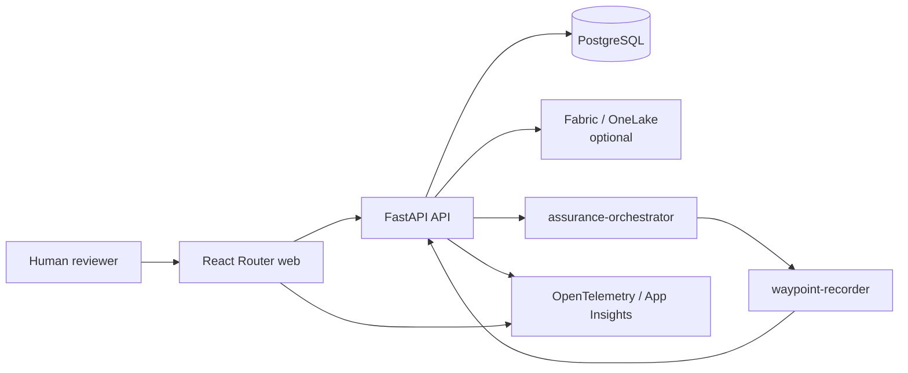

# Waypoint application architecture

Waypoint is a .NET Aspire application composed of a React Router web app, a
FastAPI API, and PostgreSQL. Azure deployments run the web and API as Container
Apps and use Azure Database for PostgreSQL.

## Runtime topology

## Governed data

The API owns invoices, work items, findings, evidence, cases, recommendations,
drafts, actions, approvals, runs, and audit records. PostgreSQL is the durable
store in local and deployed environments; local Aspire starts the database
resource automatically.

The optional OneLake integration supplies corpus document content. When it is
not configured, document APIs retain metadata and degrade to URI-only content
instead of failing the app.

## Auth and authority

- Humans sign in through MSAL and present delegated bearer tokens.
- Agents use scoped credentials configured by the deployment workflow.
- Read-only agents and evidence experts cannot create governed results.
- `assurance-orchestrator` coordinates evidence and lifecycle.
- `waypoint-recorder` is the sole agent writer.
- Seed import uses a deployment-only admin credential.

## Assurance run lifecycle

The assurance operation accepts one invoice and starts the hosted orchestrator
without holding the browser request open. The batch endpoint applies that same
invoice-scoped operation to at most 25 unique invoices with four concurrent
starts, ordered outcomes, active-run reuse, and failure isolation. The
orchestrator opens or reuses each invoice-scoped active run, executes within a
bounded runtime, and always reaches a terminal state through recorder
finalization or failure handling.

Waypoint also runs a stale-run reaper as a process-death backstop. Its timeout
must remain longer than the orchestrator's maximum runtime plus safety margin.

## API structure

Domain modules live under `api/app/modules/<domain>/` and separate:

- `schemas.py` for Pydantic request and response contracts
- `service.py` for traced business logic
- `routes.py` for HTTP routing and authorization

Shared configuration, persistence, auth, telemetry, and external clients live
under `api/app/common/`.

## Telemetry

The API and web app emit OpenTelemetry. Local traces appear in the Aspire
dashboard; deployed traces flow to Azure Monitor/Application Insights. Agent
and Waypoint correlation IDs are persisted on runs so reviewers can move from a
business record to the corresponding hosted-agent trace.

## Deployment boundary

The root `.github/workflows/deploy.yml` is the canonical cloud path. It deploys
the app, data, default hosted agents, and grounding resources, then verifies a
real orchestrator-to-recorder run. See
[docs/deployment.md](../../docs/deployment.md).

Agent quality operations remain outside the governed write path. The `/quality`
page explains the run, inspect, measure, improve, and approved-release loop;
`castia eval` and `castia optimize` own cloud credentials,
sanitized artifacts, and protected approvals.
