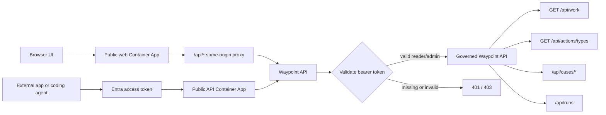

# Waypoint agent API and control-plane plan

> [!WARNING]
> Historical planning artifact retained for provenance. The implemented
> monorepo architecture, recorder-only write boundary, seller operation, and
> deployment path are documented in the root `docs/architecture.md`,
> `docs/deployment.md`, and `modules/agents/docs/AGENT_PIPELINE.md`.

## Purpose

This plan captures the current design direction for making Waypoint usable by external apps and agents while preserving the product's finance, procurement, legal, quality, and IP-sensitive governance boundaries.

It is intentionally a planning artifact. After the work is implemented and validated, convert the durable decisions into repo knowledge and update or replace this document with final architecture guidance.

## Coding-agent integration notes

Waypoint now supports two API access paths:

| Caller | Path | Purpose |
| --- | --- | --- |
| Browser UI | Public web app -> same-origin `/api/*` proxy -> API | Keep the React app stable and avoid browser cross-origin complexity. |
| External app or agent | Public API Container App -> `/api/*` directly | Let trusted non-browser callers use Waypoint without tunneling through the web app. |



Resolve the deployed direct API from Azure Container Apps or deployment output:

```text
https://<api-container-app-fqdn>
```

Resolve the deployed web proxy from Azure Container Apps or deployment output:

```text
https://<web-container-app-fqdn>/api
```

Production auth is fail-closed:

- MSAL bearer validation is enabled by default for publish/deploy.
- The deployed API does not set `APP_LOCAL_AUTH_ENABLED`.
- FastAPI docs, ReDoc, and OpenAPI schema endpoints are local-development only by default.
- Local fallback identity is only enabled by `aspire run`, only for loopback requests, and only when MSAL API validation is off.
- Unauthenticated governed API calls should return `401`.
- Headless coding agents should use an Entra-issued bearer token for the configured Waypoint API scope:

```text
api://<waypoint-api-client-id>/<required-scope>
```

API callers must send that token on every governed request:

```http
Authorization: Bearer <entra-access-token>
```

The access token must be issued by the configured Entra tenant, have the Waypoint API client ID as its audience, and include the required scope. Waypoint maps a validated bearer token to a reader context by default, with admin access granted only when the token contains an approved admin role or admin scope. Callers should treat `401` as missing/invalid authentication and `403` as authenticated but not authorized for the requested operation.

Current trust boundary: a tenant-issued token with the configured Waypoint API scope is enough for reader access. This is acceptable for the current controlled deployment posture, but production multi-agent use should require an explicit reader app role, group assignment, or principal allow-list.

Headless service callers (managed identities / service principals using client
credentials) are now supported via **app roles** (see "App-role / headless auth" below),
so a delegated user session is no longer required to write to Waypoint.

Suggested Python caller shape for a coding agent:

```python
import os
from typing import Any

import httpx
from azure.identity.aio import AzureCliCredential


WAYPOINT_API_BASE_URL = os.environ["WAYPOINT_API_BASE_URL"]
WAYPOINT_API_SCOPE = os.environ["WAYPOINT_API_SCOPE"]


async def waypoint_get(path: str) -> Any:
    async with AzureCliCredential() as credential:
        token = await credential.get_token(WAYPOINT_API_SCOPE)

    headers = {
        "Authorization": f"Bearer {token.token}",
        "Accept": "application/json",
    }
    async with httpx.AsyncClient(base_url=WAYPOINT_API_BASE_URL, timeout=30) as client:
        response = await client.get(path, headers=headers)
        response.raise_for_status()
        return response.json()


async def discover_waypoint_work() -> dict[str, Any]:
    work = await waypoint_get("/api/work")
    action_types = await waypoint_get("/api/actions/types")
    runs = await waypoint_get("/api/runs")
    return {
        "work": work,
        "action_types": action_types,
        "runs": runs,
    }
```

Configure the caller without hardcoding deployment values:

```text
WAYPOINT_API_BASE_URL=https://<api-container-app-fqdn>
WAYPOINT_API_SCOPE=api://<waypoint-api-client-id>/<required-scope>
```

When using `AzureCliCredential`, the Azure CLI application must be allowed to request the custom Waypoint API scope through admin consent or API preauthorization. Production service agents should not depend on Azure CLI credentials; use the **app-role / client-credential** path below with `<api-app-id-uri>/.default`.

## App-role / headless auth

Waypoint now authorizes app-only tokens (managed identities and service principals using
the client-credential flow) in addition to delegated user tokens. This is what lets the
Forge `aggregator` agent write to Waypoint from its per-instance managed identity with no
user session, and lets `status-concierge` read with reader-only access.

How it works:

- Delegated user tokens are validated exactly as before: they must carry the configured
  delegated scope (`scp`). Existing reader/admin UX and local development are unchanged.
- App-only tokens carry app **`roles`** (and `idtyp=app` / no `scp`). They are validated
  against the configured Waypoint **app roles** and an optional app-id allow-list, then
  mapped to Waypoint roles.

Waypoint roles follow a `reader < writer < admin` hierarchy (a higher role implies the
lower ones). Endpoint mapping:

| Operation | Required role |
| --- | --- |
| Domain reads, `/work`, `/runs` (GET), `/cases` (GET), `/config` | reader |
| `POST /runs`, `POST /cases`, recommendations, drafts, proposed actions | **writer** |
| Approvals, `POST /actions/{id}/authorize`, `/admin/seed/ledgerfield`, audit reads | admin |

Default app-role names (override per environment):

| Waypoint role | App role (default) | Settings key |
| --- | --- | --- |
| reader | `Waypoint.Read` | `APP_MSAL_READER_APP_ROLE` |
| writer | `Waypoint.Write` | `APP_MSAL_WRITER_APP_ROLE` |
| admin | `Waypoint.Admin` | `APP_MSAL_ADMIN_APP_ROLE` |

Optional defense-in-depth: `APP_MSAL_ALLOWED_APP_IDS` (comma-separated client/app IDs)
restricts which applications may present app-only tokens.

Forge alignment:

- The aggregator's managed identity must be granted the **`Waypoint.Write`** app role on
  the Waypoint API app registration; `status-concierge` is granted **`Waypoint.Read`**.
- App-only callers request `api://<waypoint-api-client-id>/.default` (client-credential
  flow) instead of a delegated scope.
- The deploy workflow emits `api_app_id_uri`, `api_default_scope`, `api_fqdn`, and
  `web_fqdn` as outputs so the umbrella workflow can grant the app roles and configure the
  Forge agents.

A coding agent should reason about Waypoint in this order:

1. Discover work with `GET /api/work`.
2. Read domain truth from invoice, finding, evidence, contract, and policy endpoints before proposing action.
3. Use cases as the governed business unit and runs as execution telemetry.
4. Use `GET /api/actions/types` to learn the closed action vocabulary.
5. Stage intent through case/action endpoints; do not invent arbitrary side effects.
6. Carry `waypoint_case_id`, `waypoint_run_id`, and `waypoint_action_id` into traces and downstream tool calls.
7. Keep IP-sensitive or restricted fields out of prompts and telemetry unless the API explicitly returns them for the caller.

## Product boundary

Waypoint is the authenticated runtime API and business control surface for contract manufacturing invoice assurance. Ledgerfield remains the source corpus for shared demo suppliers, contracts, policies, invoice scenarios, and evidence documents.

The core product promise remains stable: Waypoint reconciles supplier invoices against contract pricing, purchase orders, receipts, batch records, QA release logs, production schedules, supplier correspondence, and IP-sensitive process context to identify leakage, explain findings, and stage controlled responses.

## Current domain model posture

The existing domain model is holding up and should remain the substrate:

```text
Supplier
  -> Invoice
      -> InvoiceLine
      -> ReconciliationFinding
          -> EvidenceReference
          -> ContractDocument
          -> Policy
```

Existing API concepts such as suppliers, scenarios, invoices, invoice decisions, findings, evidence, contract documents, and policies should stay domain-focused. Avoid replacing these with generic agent-task abstractions.

## Target architecture layers

```text
Domain truth
Supplier -> Invoice -> Lines -> Findings -> Evidence / Contract / Policy

Governed work
Assurance Case -> Recommendation -> Draft -> Approval -> Authorized Intent

Agent operations
Agent Run -> Step summary -> Artifact reference -> Foundry/App Insights trace

Business telemetry
Cost rollup -> Workload attribution -> Component attribution

Model governance
Evaluation snapshot -> Dataset/model references -> Foundry eval/fine-tuning links
```

## Key decisions

| Decision | Direction |
| --- | --- |
| Primary workflow noun | Use **assurance case** as the durable governed unit around an invoice or finding. |
| Case vs run | A case is the business investigation; a run is execution telemetry. One run can touch many cases; one case can have many runs. |
| Work queue | Start as a derived view over invoices, findings, and cases, not a new source-of-truth table. |
| Context bundle | Add an agent-friendly context endpoint, likely `GET /api/invoices/{id}/context`, with classification-aware redaction and allowed actions. |
| Actions | Use closed server-owned action types. Do not expose a generic command bus. |
| Execute semantics | Prefer **authorize intent** over **execute**. Waypoint records approved intent; downstream systems perform external side effects. |
| Approvals | Bind approvals to immutable draft/action versions and content hashes. |
| Audit | Keep request audit separate from business decision audit. |
| Foundry boundary | Foundry is the AI ops plane; Waypoint is the business control and audit plane. |

## Proposed API shape

Keep the current domain reads as the substrate:

```text
GET  /api/suppliers
GET  /api/scenarios
GET  /api/invoices
GET  /api/invoices?supplier_id={supplier_id}&invoice_number={invoice_number}
GET  /api/invoices/{id}
GET  /api/invoice-decisions
GET  /api/findings
GET  /api/findings/{id}/validations
POST /api/findings/{id}/validations
GET  /api/evidence
GET  /api/contract-documents/{id}
GET  /api/policies/{id}
POST /api/admin/seed/ledgerfield
```

`GET /api/invoices?supplier_id=...&invoice_number=...` is the stable business-key
lookup for agents that know supplier + invoice number but not the Waypoint invoice id.
It performs exact matching only; fuzzy or destructive reconciliation must not be used as a
persistence primitive.

`POST /api/findings/{finding_id}/validations` records an additive rerun observation for
an existing finding. The request body carries `run_id`, optional `case_id`, `validator`,
`source`, `outcome` (for example `validated_existing_finding`), `confidence`,
`evidence_ids`, `basis_summary`, `evidence_snapshot`, optional `evidence_hash`, and
`metadata`. Waypoint resolves `invoice_id` from the finding, stamps `created_at`,
`created_by`, and `auth_source`, and inserts a new `finding_validations` row. It never
updates the finding, evidence, case, recommendation, draft, approval, or prior validation
record, so repeated Pacioli reruns produce a ledger of observations instead of replacing
history.

Add a governed case surface:

```text
GET  /api/work
GET  /api/invoices/{id}/context
GET  /api/cases
GET  /api/cases/{id}
POST /api/cases/{id}/recommendations
POST /api/cases/{id}/drafts
POST /api/cases/{id}/actions
POST /api/cases/{id}/approvals
POST /api/actions/{id}/authorize
GET  /api/actions/types
GET  /api/audit/decisions
```

Add a thin agent operations surface that anchors business context and links to Foundry/App Insights:

```text
GET  /api/runs
POST /api/runs
```

Do not mirror every raw Foundry trace span in Waypoint. Persist only business milestones, governed artifact hashes, summaries, and correlation identifiers.

### Run anchor lifecycle (open, dedupe, reap)

Runs are execution telemetry, so their lifecycle is optimized for a single honest active anchor per invoice rather than durable business state:

- **Open / dedupe.** `POST /api/runs` resolves in this order: (1) an exact `idempotency_key` match returns the existing anchor; (2) otherwise, if an *active* run (`running`/`pending`) already exists with the same `name` (`assurance:{invoice_id}`), that run is reused; (3) otherwise a new run is created. This means two concurrent orchestrator triggers for the same invoice reconcile onto one anchor instead of racing to create parallel active runs. Callers should send `name = "assurance:{invoice_id}"` plus their per-execution `idempotency_key`, and finalize by `PATCH`-ing the returned run id to a terminal status. An enriched re-open backfills correlation ids (for example `app_insights_operation_id`) that the early-open lacked.
- **Reap.** A background sweep transitions runs left in the `running` state past a TTL (based on `updated_at`) to `status='failed'` with `metadata.reaped=true` and a `reap_reason`, so a stalled orchestration cannot leave an anchor stuck `running` forever. The reap write is a **compare-and-swap**: the row is only flipped to `failed` if it is *still* `running` and *still* older than the cutoff at write time (Postgres applies the predicate in the `UPDATE` and skips on 0 rows affected; the in-memory store re-checks before writing), so a real finalize that lands in the window between the stale read and the reap write always wins and a genuinely completed run is never clobbered back to `failed`. That same property makes it idempotent under container restart and multiple replicas (racing sweepers converge on the same terminal state, the losers no-op). The reaper is a **process-death backstop, not a heartbeat enforcer**: the Forge orchestrator bounds its own runtime (default 30m) and guarantees finalize in a `finally` block (success → completed/partial, timeout/exception → failed) and does **not** heartbeat, so the default TTL is set *above* that bound (35m) — a run still `running` past ~35m means the orchestrator process died before its own finally could run (container restart/OOM), a genuine orphan, while a run under the TTL is treated as legitimately progressing even though `updated_at` has not moved. `pending` runs are **not** reaped by default — they are queued batch-enrollment placeholders that legitimately sit idle before starting, so reaping them would kill queued work; pending reaping is opt-in via a separate long TTL. Tunables (all defaulted, no deploy input required): `APP_RUN_REAPER_ENABLED`, `APP_RUN_REAPER_TTL_SECONDS` (default 2100 / 35m, `running` only), `APP_RUN_REAPER_PENDING_TTL_SECONDS` (default 0 / disabled; set e.g. 7200 for a 2h pending backstop), `APP_RUN_REAPER_SWEEP_INTERVAL_SECONDS` (default 60).

## Database shape changes

Add a workflow/control layer on top of the existing domain tables:

| Table | Purpose |
| --- | --- |
| `assurance_cases` | Durable investigation/control record for an invoice or finding. |
| `finding_validations` | Append-only rerun/accounting records showing that an agent run observed and validated an existing finding. |
| `case_recommendations` | Agent or user recommendations with rationale, confidence, evidence links, and immutable versions. |
| `case_drafts` | Supplier dispute notes, escalation packets, approval summaries, and other staged text artifacts. |
| `action_types` | Closed action vocabulary and required approval gates. |
| `proposed_actions` | Staged action intents, always referencing an action type. |
| `case_approvals` | Human approvals bound to a proposed action or draft version and content hash. |
| `authorized_intents` | Approved business intent records emitted for downstream execution. |
| `decision_audit_events` | Append-only business audit trail distinct from request audit. |
| `agent_runs` | Business anchor for agent execution with Waypoint and Foundry correlation IDs. |
| `cost_rollups` | Business workload and component cost summaries. |
| `evaluation_snapshots` | Durable metric snapshots and Foundry references used by Waypoint UI or governance. |

Prefer a view for the initial work queue:

```text
work_queue = open findings + invoice status + severity + money at risk + latest case state
```

## Foundry offload boundary

Offload raw AI operations to Microsoft Foundry and Azure Monitor where possible:

| Concern | Waypoint owns | Foundry/App Insights owns |
| --- | --- | --- |
| Agent traces | Correlation IDs and outcome summaries | Raw spans, tool calls, latency, errors, token usage |
| Runs screen | Business run summaries and governed artifact links | Detailed trace/span drill-down |
| Costs screen | Workload/case/component rollups | Raw token, duration, and tool-call telemetry |
| Optimize screen | Metric snapshots and stable UI rollups | Eval suites, batch evals, continuous eval, prompt optimization, comparisons |
| Fine-tuning | Business labels, dataset lineage refs, selected deployment refs | SFT/DPO/RFT jobs, checkpoints, training curves, model deployments |

Core rule:

> Snapshot anything that affects a governed decision; reference Foundry for drill-down only.

If an approval, escalation, recovery recommendation, or audit packet depends on a model output, evaluator score, prompt response, or cost value, copy the decision-relevant facts into Waypoint at decision time. Store the Foundry reference as a convenience link, not as the only durable record.

## Correlation requirements

Every agent invocation should carry Waypoint-controlled identifiers into trace metadata:

```text
waypoint_case_id
waypoint_run_id
waypoint_action_id, when applicable
```

Persist returned Foundry identifiers when available:

```text
foundry_agent_name
foundry_conversation_id
foundry_response_id
app_insights_operation_id
foundry_eval_id
foundry_eval_run_id
dataset_name
dataset_version
model_deployment_name
checkpoint_id
```

Do not rely on timestamp matching to connect a business decision to AI telemetry.

## Classification and redaction

The invoice context bundle should be classification-aware. It should disclose what was returned, what was redacted, and which actions the caller is allowed to stage.

Suggested classification vocabulary:

```text
standard
confidential
ip_sensitive
restricted
```

IP-sensitive context must be gated before it enters agent prompts or telemetry. Do not rely solely on post-hoc redaction after content has already been traced to App Insights or harvested into evaluation datasets.

## UI reliability requirements

Waypoint screens should render from Waypoint-owned snapshots and rollups. Foundry/App Insights data should progressively enhance drill-down views.

Examples:

- Decision and approval screens render from Waypoint even if Foundry is unavailable.
- Optimize dashboards show last-known metric snapshots with `last_synced_at`.
- Trace links can show unavailable, expired, or not captured without implying no evaluation occurred.
- Audit views distinguish `live_available`, `snapshot_only`, and `expired` evidence states.

## Implementation sequence

1. Add assurance case data model and derived work queue.
2. Add invoice context bundle with allowed actions and redaction metadata.
3. Add recommendations, drafts, proposed actions, approvals, authorized intents, and decision audit.
4. Add agent run anchors and Waypoint-to-Foundry correlation fields.
5. Add cost and evaluation snapshot rollups for the Costs and Optimize screens.
6. Integrate Foundry/App Insights drill-down links and sync jobs.
7. ~~Add service auth support for headless agents using Entra app roles.~~ **Done** — see
   "App-role / headless auth". App-only tokens are mapped to reader/writer/admin via
   configurable app roles; writes use a least-privilege `writer` role.

## Deploy and configuration reference

### Reproducible Ledgerfield seed

The API loads a seed at startup from, in priority order:

1. `APP_LEDGERFIELD_SEED_URI` — an Azure Blob URL fetched via managed identity (requires
   the `azure` optional dependencies). Use for an environment-managed seed.
2. `APP_LEDGERFIELD_SEED_PATH` — a local/in-image file path. The recommended one-click
   default is to bake `waypoint-seed.json` into the API image build context and point this
   at it. The umbrella/ledgerfield pipeline regenerates the seed and stages it before
   `aspire deploy`.

`POST /api/admin/seed/ledgerfield` (admin) remains the runtime re-seed path. When either
seed source is configured, the built-in demo seed is not loaded.

### Foundry / App Insights drill-down config

`GET /api/config` (reader) returns non-secret deep-link bases consumed by the Runs, Costs,
and Optimize views: `foundry_endpoint`, `foundry_project_url`, `app_insights_resource_id`.
Wire them via `APP_FOUNDRY_ENDPOINT`, `APP_FOUNDRY_PROJECT_URL`,
`APP_APP_INSIGHTS_RESOURCE_ID` (Aspire config keys `Waypoint:Foundry:*` /
`Waypoint:AppInsights:ResourceId`).

### Non-interactive deploy inputs

`.github/workflows/deploy.yml` runs `aspire deploy --non-interactive` over OIDC and exposes
a `workflow_call` trigger so an umbrella workflow can deploy Waypoint headlessly. Required
configuration:

| Kind | Name | Purpose |
| --- | --- | --- |
| secret | `AZURE_CLIENT_ID` / `AZURE_TENANT_ID` / `AZURE_SUBSCRIPTION_ID` | OIDC login |
| secret | `AZURE_LOCATION` / `AZURE_RESOURCE_GROUP` | Deploy target |
| secret | `POSTGRES_APP_PASSWORD` | Least-privilege DB role |
| var | `WAYPOINT_MSAL_TENANT_ID` / `WAYPOINT_MSAL_CLIENT_ID` / `WAYPOINT_MSAL_REDIRECT_URI` | Auth |
| var | `WAYPOINT_MSAL_WRITER_APP_ROLE` / `_READER_APP_ROLE` / `_ADMIN_APP_ROLE` / `_ALLOWED_APP_IDS` | App-role mapping |
| var | `WAYPOINT_FOUNDRY_ENDPOINT` / `WAYPOINT_FOUNDRY_PROJECT_URL` / `WAYPOINT_APP_INSIGHTS_RESOURCE_ID` | Drill-down |
| var | `WAYPOINT_LEDGERFIELD_SEED_URI` | Optional blob seed |
| var | `WAYPOINT_POSTGRES_SERVER_NAME` | DB server |

Deploy outputs (`api_fqdn`, `web_fqdn`, `api_app_id_uri`, `api_default_scope`) let the
umbrella grant app roles and configure the Forge agents' `WAYPOINT_API_BASE_URL` /
`WAYPOINT_API_SCOPE`.

## Validation questions before implementation

- Which action types are in the initial closed vocabulary?
- Which approval gates map to finance, procurement, legal, and quality?
- What is the minimum viable context bundle for an invoice assurance agent?
- Which IP-sensitive fields must never enter Foundry traces?
- What Foundry/App Insights retention and sampling configuration is acceptable?
- Which Optimize metrics are product-critical snapshots versus drill-down-only eval details?
