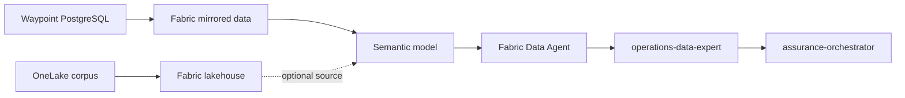

# FabricIQ evidence lane

FabricIQ is the planned structured operational-data lane for invoice assurance.
Its hosted expert is `operations-data-expert`.

> [!IMPORTANT]
> Fabric/OneLake storage is deployed by default, but the FabricIQ expert lane is
> disabled by default. Do not treat a provisioned lakehouse as proof that the
> expert is grounded in a live Fabric Data Agent.

## Current posture

| Capability | State |
| --- | --- |
| Fabric capacity, workspace, and lakehouse | Available through the root deployment. |
| Corpus upload to OneLake | Available and validated as part of the default deployment. |
| Optional semantic model and Data Agent tooling | Present as implementation and planning assets. |
| `operations-data-expert` deployment | Opt-in. |
| FabricIQ orchestrator fan-out | Opt-in. |
| Validated live FabricIQ evidence source | Not yet part of the default seller path. |

The expert must continue to return an explicit unavailable or no-source result
until a real Fabric Data Agent connection and known-positive evidence case have
been validated.

## Intended architecture



The expected evidence includes supplier master data, purchase orders, receipts,
batch and release records, payment state, duplicate checks, and historical rate
facts. Contract and policy interpretation remains in FoundryIQ.

## Enabling the lane

Use the root deployment input:

```text
fabriciq_enabled=true
```

Enabling the flag adds `operations-data-expert` to the deployment matrix and
wires its endpoint into the orchestrator. It does not create trustworthy
evidence by itself; the environment must also supply and validate the real
Fabric Data Agent source.

## Validation required before default enablement

1. Define the production source tables and invoice join keys.
2. Configure the Fabric Data Agent and auth boundary.
3. Prove a direct known-positive expert response with citations.
4. Prove orchestrator fan-out preserves those citations.
5. Add repeatable evaluation coverage.
6. Confirm no fallback fabricates Fabric-backed claims from Waypoint or corpus
   records.

Until those checks pass, keep `fabriciq_enabled=false`.

## Related docs

- [OneLake corpus storage](onelake-corpus.md)
- [Azure deployment](../../../docs/deployment.md)
- [Agent catalog](../../../modules/agents/docs/AGENT_CATALOG.md)
