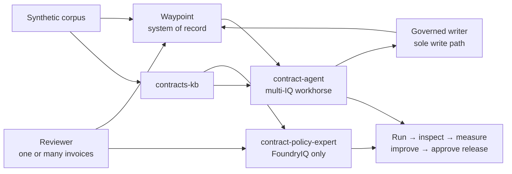

# Architecture

Waypoint is a monorepo reference application for Caldova's synthetic contract
manufacturing invoice-assurance scenario.

## Repository layers

| Layer | Path | Responsibility |
| --- | --- | --- |
| Application | `apps/waypoint/` | Governed API, web UI, PostgreSQL, auth, telemetry, assurance operations, and audit. |
| Corpus | `modules/corpus/` | Synthetic suppliers, contracts, policies, invoices, scenarios, seed generation, and upload tooling. |
| Agents | `modules/agents/` | Three thin Castia agents: prompt-grounded `contract-expert`, FoundryIQ-only `contract-policy-expert`, and full multi-IQ `contract-agent`. |
| Evaluations | `modules/evals/` | Caliber datasets, graders, calibration, and repeatable quality gates. |
| Optimization | `modules/optimization/` | Foundry Agent Optimizer, RFT/RLE planning, cost-quality views, and promotion metadata. |
| Deployment | `tools/deploy/` | OIDC, Key Vault, MSAL, manifests, probes, and lower-level deployment helpers. |

The agents are deployed with `azd` + `castia`; the Waypoint app deploys
separately from `apps/waypoint`.

## Default assurance flow

`contract-policy-expert` has one evidence plane: FoundryIQ through
`contracts-kb`. `contract-agent` is the full workhorse: FoundryIQ plus WorkIQ,
WebIQ, FabricIQ, Waypoint API tools, and the governed writer.

## Governance invariants

1. Waypoint is the system of record.
2. The agent's evidence and status tools are read-only.
3. The agent runs a deterministic, invoice-scoped assurance flow.
4. A single governed writer is the only path that writes governed results.
5. Runs are invoice-scoped, bounded, correlated, and terminally finalized.
6. Missing evidence must be reported as unavailable rather than fabricated.
7. Secrets live outside source control.

## Deployment and quality

The Waypoint app deploys from `apps/waypoint`; agents deploy with `azd` +
`castia` to the caldova Foundry project. See
[deployment](deployment.md).

Agent quality follows Foundry-native evaluation and Agent Optimizer plus Caliber
datasets, deterministic graders, calibration, telemetry harvesting, and RFT/RLE
planning. The retired P2M framework is not part of the architecture.

Deployment acceptance intentionally proves one invoice per invocation. The
application also provides a batch envelope over the same invoice-scoped
lifecycle: up to 25 unique invoices, four concurrent starts, active-run reuse,
ordered results, and independent failures.

Agent quality operations are intentionally separate from the application write
path. The authenticated `/quality` page explains a five-step loop — run,
inspect, measure, improve, and release with approval — backed by `castia eval` and `castia optimize`. Use `contract-policy-expert` for
FoundryIQ-only answer-quality optimization and `contract-agent` for workflow and
writeback correctness. Cloud credentials, evidence, and approvals stay outside
the browser.
