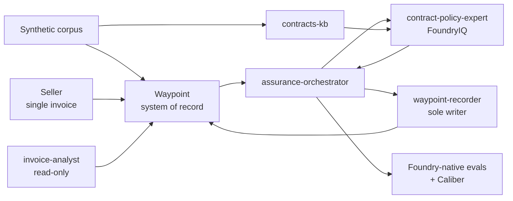

# Architecture

Waypoint is a monorepo reference application for Caldova's synthetic contract
manufacturing invoice-assurance scenario.

## Repository layers

| Layer | Path | Responsibility |
| --- | --- | --- |
| Application | `apps/waypoint/` | Governed API, web UI, PostgreSQL, auth, telemetry, seller operations, and audit. |
| Corpus | `modules/corpus/` | Synthetic suppliers, contracts, policies, invoices, scenarios, seed generation, and upload tooling. |
| Agents | `modules/agents/` | Hosted agents, prompts, toolboxes, orchestration, and the recorder write boundary. |
| Evaluations | `modules/evals/` | Caliber datasets, graders, calibration, and repeatable quality gates. |
| Optimization | `modules/optimization/` | Foundry Agent Optimizer, RFT/RLE planning, cost-quality views, and promotion metadata. |
| Deployment | `tools/deploy/` | OIDC, Key Vault, MSAL, manifests, probes, and lower-level deployment helpers. |

The root `/.github/workflows/deploy.yml` composes all layers into one Azure
environment.

## Default assurance flow

WorkIQ, WebIQ, and FabricIQ experts are optional. They are deployed and wired
only when their lane input is enabled.

## Governance invariants

1. Waypoint is the system of record.
2. Evidence experts and `invoice-analyst` are read-only.
3. `assurance-orchestrator` owns deterministic lifecycle and synthesis.
4. `waypoint-recorder` is the only agent that writes governed results.
5. Runs are invoice-scoped, bounded, correlated, and terminally finalized.
6. Optional evidence must be reported as unavailable rather than fabricated.
7. Secrets live outside source control.

## Deployment and quality

The validated default deployment includes the app, corpus, Fabric/OneLake
storage, Foundry resources, the four default agents, seed import, seller wiring,
and live acceptance. An unchanged rerun has also been validated.

Agent quality follows Foundry-native evaluation and Agent Optimizer plus Caliber
datasets, deterministic graders, calibration, telemetry harvesting, and RFT/RLE
planning. The retired P2M framework is not part of the architecture.

The current seller and acceptance surfaces process one invoice per invocation.
Batch assurance and separate quality-operation triggers are not active runtime
features.
