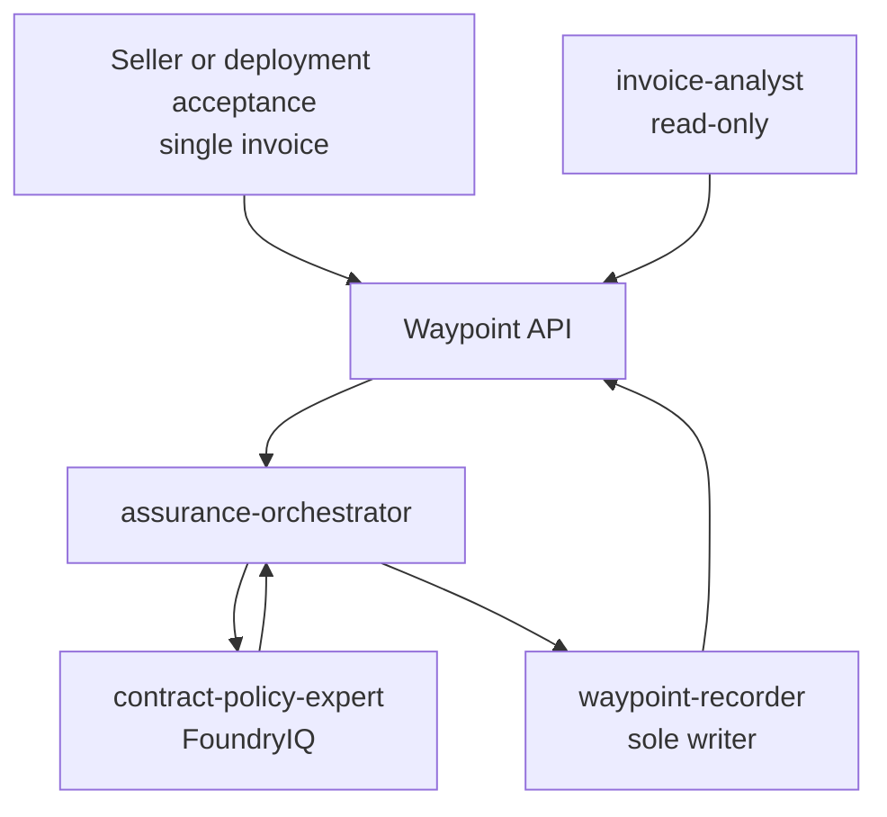

# Invoice assurance agent pipeline

Waypoint uses a coordinator, read-only evidence experts, a read-only analyst,
and one governed writer.

## Default topology

WorkIQ, WebIQ, and FabricIQ experts are added only when their deployment input is
enabled. FoundryIQ is the sole default evidence lane.

## Responsibilities

- **`invoice-analyst`** answers human-facing invoice and status questions. It
  reads Waypoint and grounded evidence but never creates governed records.
- **`assurance-orchestrator`** opens or reuses the invoice run, performs
  deterministic checks, gathers selected expert evidence, synthesizes the
  decision, and guarantees terminal lifecycle handling.
- **Evidence experts** return cited evidence from one IQ plane. They do not make
  the final decision or write Waypoint records.
- **`waypoint-recorder`** validates the final plan and performs all agent-originated
  Waypoint writes.

## Run lifecycle

1. The reviewer or acceptance path submits one invoice.
2. Waypoint returns an accepted operation and invokes the hosted orchestrator.
3. The orchestrator opens or reuses the invoice-scoped active run.
4. Deterministic checks and enabled evidence lanes execute within the configured
   runtime budget.
5. The orchestrator synthesizes an assurance outcome:
   `approve`, `review`, `recover`, or `escalate`.
6. The recorder writes the governed result and finalizes the run.
7. Timeout or error handling finalizes the run as failed.

The Waypoint stale-run reaper is a process-death backstop, not the normal
finalization path.

## Evidence contract

Each expert returns:

- its agent and IQ plane
- the invoice ID
- grounded claims with stable source references
- classification and confidence
- a summary
- unsupported or unavailable evidence

Experts must return unknown or no-evidence states rather than guessing.

## Authority and auth

- Human users authenticate with delegated MSAL tokens.
- Deployment supplies scoped reader and writer credentials to hosted agents.
- Reader authority goes to analyst and read paths.
- Writer authority goes only to `waypoint-recorder`.
- Admin authority is reserved for deployment seed import and human
  administration.

## Current scope

Deployment acceptance processes one invoice per invocation. The Waypoint app
also exposes a batch envelope over the same invoice-scoped lifecycle: at most 25
unique invoices, four concurrent starts, active-run reuse, ordered outcomes, and
failure isolation. The orchestrator itself remains single-invoice; the app owns
batch coordination.

Agent quality uses Foundry-native evaluations and Agent Optimizer with Caliber
datasets, graders, calibration, telemetry, and RFT/RLE planning. The controlled
operator sequence is run, inspect, measure, improve, and release with approval;
see `docs/quality-operations.md`.
