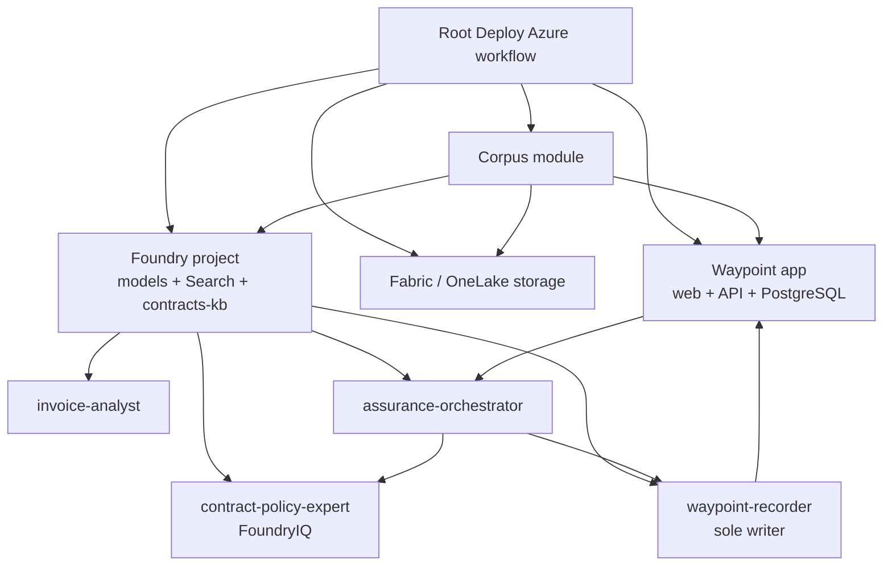

# Deployment architecture

Waypoint's Azure deployment is owned by the monorepo root workflow:
`.github/workflows/deploy.yml`. It composes source and tooling from
`apps/waypoint`, `modules/corpus`, `modules/agents`, and `tools/deploy` directly.

## Topology

WorkIQ, WebIQ, and FabricIQ experts are optional nodes. The workflow adds them
to the deployment matrix and orchestrator wiring only when their lane input is
enabled.

## Ordered stages

1. Validate OIDC configuration and build the selected agent matrix.
2. Ensure the state resource group, Key Vault, and generated-once secrets.
3. Ensure the Waypoint MSAL application, scopes, roles, and redirect URIs.
4. Generate the corpus seed.
5. Deploy the Aspire app and PostgreSQL configuration.
6. Provision Fabric/OneLake storage when enabled.
7. Provision the Foundry account, project, models, Search, storage, and
   knowledge-base connection.
8. Deploy the default agents plus selected optional experts.
9. Wire the app's assurance operation and orchestrator endpoints.
10. Upload OneLake and contracts knowledge-base content.
11. Import the Waypoint seed.
12. Probe the deployment, inventory active agents, drive one invoice through the
    hosted orchestrator, and verify recorder finalization.

## State and idempotency

- GitHub authenticates with OIDC; no Azure client secret is stored.
- Key Vault holds generated API keys and database passwords.
- The MSAL application and cloud resources are reconciled by stable names.
- Custom environments require explicit isolated resource names.
- Agent deploy computes a fingerprint from source, runtime configuration, and
  relevant infrastructure values. A matching active version is reused.
- Acceptance evidence is tied to the deployed commit and contains no secrets.

The validated unchanged rerun exercised this behavior. It did not create a
second environment or unnecessary hosted-agent versions.

## Authority boundaries

- Humans use delegated MSAL tokens.
- Agents receive scoped Waypoint credentials from Key Vault.
- `invoice-analyst` and evidence experts are read-only.
- `assurance-orchestrator` coordinates the run but does not write governed
  results directly.
- `waypoint-recorder` is the only agent authorized to persist run results.
- Seed import uses the admin key only during deployment.

## Current scope

The seller and acceptance paths operate on one invoice per invocation. The
repository does not currently expose a validated batch-assurance or separate
quality-operation deployment surface. Agent quality uses Foundry-native
evaluations and Agent Optimizer together with Caliber tooling.
